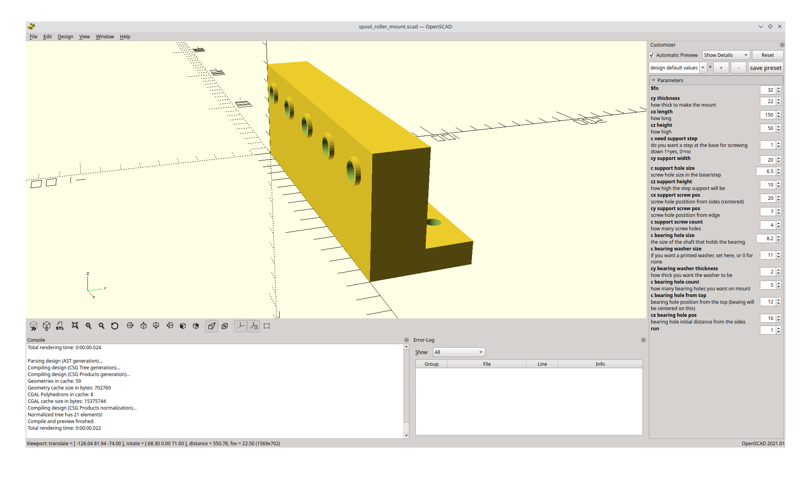

# Spool roller for filament or strapping

### technically this is just a mount, you attach bearings to the side.

Don't even need to use bearings, it can be used as just a angle bracket.

I use 608 bearings (hole size easily changed) bolted into whichever holes 
is best suited. Use v-bearings or sleeves.

you can have just a single bearing mount, or a mount with multiple mounting
points and support screws. With or without built in washer.

various options in the scad file.

